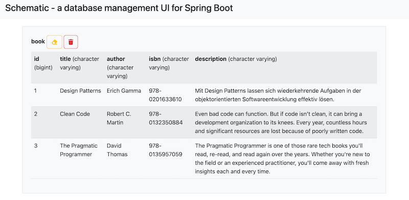
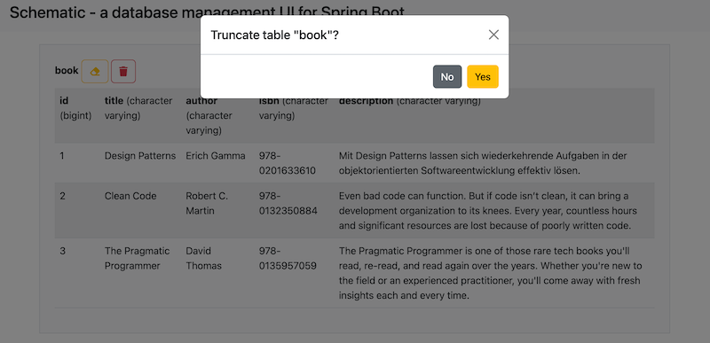
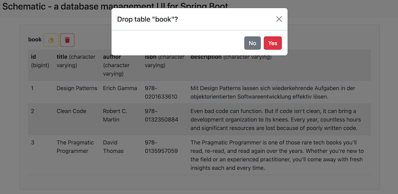

# Schematic

[](https://opensource.org/licenses/MIT)
[](https://maven-badges.herokuapp.com/maven-central/com.bjoernkw/schematic)


**Schematic** is a simple database management UI for Spring Boot.

## Getting Started

To use Schematic, you need to add the following Maven dependency to your project's `pom.xml`:

```xml
<dependency>
    <groupId>com.bjoernkw</groupId>
    <artifactId>schematic</artifactId>
    <version>0.1.7</version>
</dependency>
```

After that, simply restart your Spring Boot application. **Schematic** will be available under http://localhost:8080/schematic/tables
and show the database tables for the database connection configured for your application.

### Screenshots





### Gitpod environment
[](https://gitpod.io/#https://github.com/BjoernKW/Schematic)

### Prerequisites

* [Java 17](https://openjdk.org/projects/jdk/17/)
* [Maven](https://maven.apache.org/)
* a [Spring Boot](https://spring.io/projects/spring-boot/) application to install **Schematic** into

## Built With

* [Spring Boot](https://spring.io/projects/spring-boot/)
* [Maven](https://maven.apache.org/)

## License

[MIT License](https://opensource.org/licenses/MIT)

## Authors

* **[Björn Wilmsmann](https://bjoernkw.com)**
