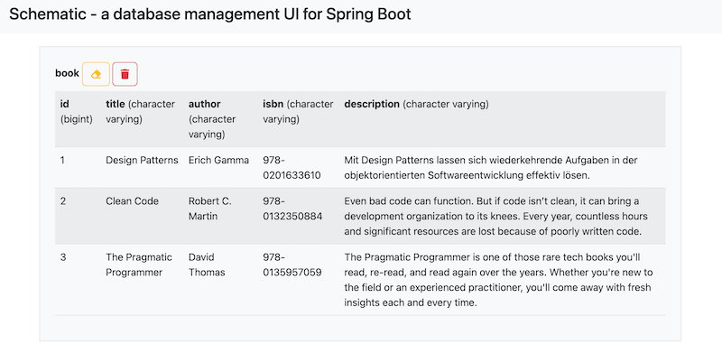
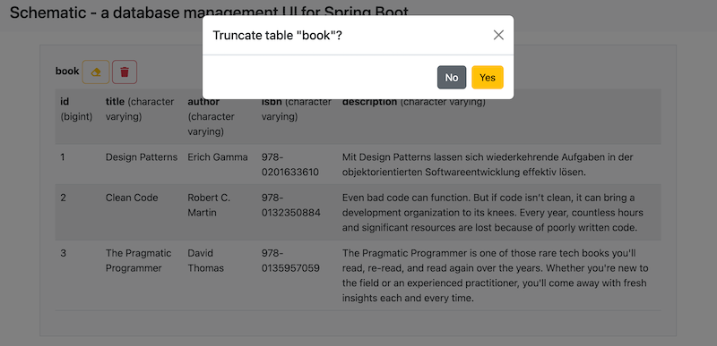
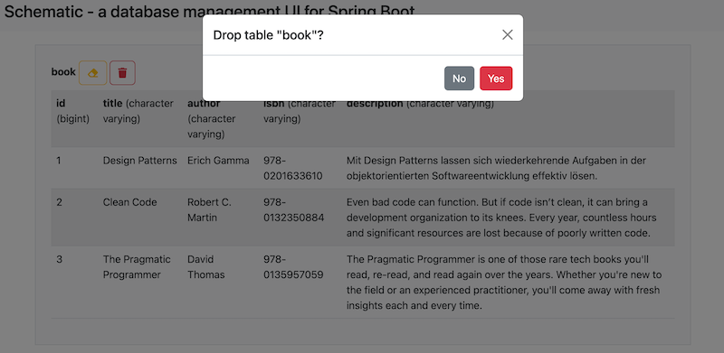

# Schematic

[](https://opensource.org/licenses/MIT)
[](https://maven-badges.herokuapp.com/maven-central/com.bjoernkw/schematic)


**Schematic** is a simple database management UI for Spring Boot.

## Getting Started

To use **Schematic**, you need to add the following Maven dependency to your project's `pom.xml`:

```xml
<dependency>
    <groupId>com.bjoernkw</groupId>
    <artifactId>schematic</artifactId>
    <version>1.1.0</version>
</dependency>
```

After that, simply restart your Spring Boot application. **Schematic** will be available under http://localhost:8080/schematic/tables
and show the database tables for the database connection configured for your application.

## Configuration

Add any of the following properties to your `application.yml` (or `application.properties`) to customise **Schematic**:

```yaml
schematic:
  path: custom-path-for-schematic   # URL path for the UI (default: schematic)
  root-path: /MyApplication         # Root path of the host application (default: /)
  preview-row-limit: 25             # Maximum rows shown in the table preview (default: 10)
```

`preview-row-limit` must be a positive integer. The application will fail to start with a descriptive error if a value less than 1 is configured.

## Access Control

By default **Schematic** shows all tables and permits all operations. To restrict access, implement the `SchematicTableFilter` interface and register it as a Spring bean:

```java
@Component
public class MyTableFilter implements SchematicTableFilter {

    @Override
    public boolean isTableVisible(String tableName) {
        // hide internal tables from the UI
        return !tableName.startsWith("internal_");
    }

    @Override
    public boolean isOperationPermitted(String tableName, TableOperation operation) {
        // allow only TRUNCATE, never DROP
        return operation == TableOperation.TRUNCATE;
    }
}
```

When a `SchematicTableFilter` bean is present:

- Tables for which `isTableVisible` returns `false` are hidden from the table listing, the row preview, and the ER diagram.
- Operation buttons (Truncate / Drop) are hidden for tables where `isOperationPermitted` returns `false`. Direct requests for restricted operations are rejected with HTTP 403.
- If the filter throws an exception for a specific table, that table is treated as not visible and all its operations are blocked (fail-closed).
- Both interface methods have permissive default implementations (`return true`), so you only need to override the methods relevant to your use case.

## Query History

Every SQL query submitted through the **Schematic** UI is automatically saved to browser local storage (up to 50 entries, most recent first). On the next visit, click the **History** dropdown above the SQL query input to select and re-run a previous query. Use **Clear history** to remove all stored entries.

History is stored entirely in the browser — no query data is sent to or persisted by the server. If the browser's Web Storage API is unavailable, queries execute normally and the history dropdown is silently suppressed.

### Screenshots





### Gitpod environment
[](https://gitpod.io/#https://github.com/BjoernKW/Schematic)

### Prerequisites

* [Java 21](https://openjdk.org/projects/jdk/21/)
* [Maven](https://maven.apache.org/)
* a [Spring Boot](https://spring.io/projects/spring-boot/) application to install **Schematic** into

## Built With

* [Spring Boot](https://spring.io/projects/spring-boot/)
* [Maven](https://maven.apache.org/)
* [Thymeleaf](https://www.thymeleaf.org/)
* [Bootstrap](https://getbootstrap.com/)
* [Font Awesome](https://fontawesome.com/)
* [Mermaid](https://mermaid.js.org/)

## License

[MIT License](https://opensource.org/licenses/MIT)

## Authors

* **[Björn Wilmsmann](https://bjoernkw.com)**
