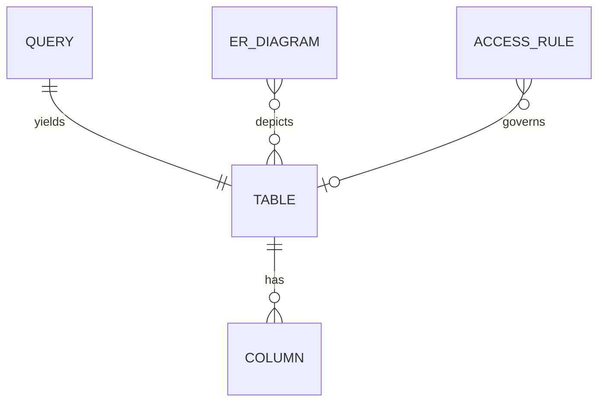

# Entity Model

## Entity Relationship Diagram

### TABLE

Represents a database table discovered through schema introspection, or the transient result set of an ad-hoc SQL query.

| Attribute     | Description                                                | Data Type | Length/Precision | Validation Rules              |
|--------[entity_model.md](entity_model.md)-------|------------------------------------------------------------|-----------|------------------|-------------------------------|
| id            | Unique identifier                                          | Long      | 19               | Primary Key, Sequence         |
| tableName     | Name of the table as reported by INFORMATION_SCHEMA        | String    | 100              | Not Null                      |
| schemaName    | Database schema that owns the table                        | String    | 100              | Not Null                      |
| isQueryResult | Distinguishes a query result set from a schema table       | Boolean   | 1                | Not Null                      |

**Constraints:** `tableName` and `schemaName` together must be unique among rows where `isQueryResult` is false.

### COLUMN

Represents a column belonging to a schema table or a query result set.

| Attribute       | Description                                              | Data Type | Length/Precision | Validation Rules                  |
|-----------------|----------------------------------------------------------|-----------|------------------|-----------------------------------|
| id              | Unique identifier                                        | Long      | 19               | Primary Key, Sequence             |
| tableId         | Reference to the owning table or result set              | Long      | 19               | Not Null, Foreign Key (TABLE.id)  |
| columnName      | Name of the column                                       | String    | 100              | Not Null                          |
| dataType        | SQL data type of the column as reported by the database  | String    | 100              | Not Null                          |
| ordinalPosition | One-based position of the column in its table            | Integer   | 10               | Not Null, Min: 1                  |

### QUERY

Represents an ad-hoc SQL statement submitted by the user through the Schematic UI.

| Attribute   | Description                                       | Data Type | Length/Precision | Validation Rules      |
|-------------|---------------------------------------------------|-----------|------------------|-----------------------|
| id          | Unique identifier                                 | Long      | 19               | Primary Key, Sequence |
| sql         | Full SQL statement as entered by the user         | String    | 5000             | Not Null              |
| executedAt  | Timestamp when the query was executed             | DateTime  | -                | Not Null              |
| resultTableId | Reference to the TABLE that holds the result set | Long      | 19               | Not Null, Foreign Key (TABLE.id) |

### ER_DIAGRAM

Represents a Mermaid entity-relationship diagram generated from the live database schema.

| Attribute    | Description                                                  | Data Type | Length/Precision | Validation Rules                     |
|--------------|--------------------------------------------------------------|-----------|------------------|--------------------------------------|
| id           | Unique identifier                                            | Long      | 19               | Primary Key, Sequence                |
| source       | Full Mermaid diagram source text                             | String    | 50000            | Not Null                             |
| databaseType | Database vendor that produced the diagram                    | String    | 50               | Not Null, Values: POSTGRESQL, OTHER  |
| generatedAt  | Timestamp when the diagram was generated                     | DateTime  | -                | Not Null                             |

### ACCESS_RULE

Represents a host-application-defined rule that restricts the visibility of a table or the operations permitted on it within the Schematic UI.

| Attribute        | Description                                                             | Data Type | Length/Precision | Validation Rules                  |
|------------------|-------------------------------------------------------------------------|-----------|------------------|-----------------------------------|
| id               | Unique identifier                                                       | Long      | 19               | Primary Key, Sequence             |
| tableNamePattern | Table name or glob pattern this rule matches against                    | String    | 100              | Not Null                          |
| visible          | Whether matching tables appear in listings and the ER diagram           | Boolean   | 1                | Not Null                          |
| allowDrop        | Whether DROP TABLE is permitted on matching tables                      | Boolean   | 1                | Not Null                          |
| allowTruncate    | Whether TRUNCATE TABLE is permitted on matching tables                  | Boolean   | 1                | Not Null                          |

### QUERY_HISTORY_ENTRY

Represents a previously executed SQL query persisted client-side for re-use from the query history dropdown.

| Attribute   | Description                                                 | Data Type | Length/Precision | Validation Rules                        |
|-------------|-------------------------------------------------------------|-----------|------------------|-----------------------------------------|
| id          | Client-generated identifier                                 | String    | 36               | Primary Key                             |
| sql         | SQL statement as entered by the user                        | String    | 5000             | Not Null                                |
| executedAt  | Timestamp when the query was executed                       | DateTime  | -                | Not Null                                |
| storage     | Mechanism used to persist the entry                         | String    | 30               | Not Null, Values: BROWSER_LOCAL_STORAGE |

### CONFIGURATION

Holds the runtime configuration settings for the Schematic library instance.

| Attribute | Description                                              | Data Type | Length/Precision | Validation Rules      |
|-----------|----------------------------------------------------------|-----------|------------------|-----------------------|
| id        | Unique identifier                                        | Long      | 19               | Primary Key, Sequence |
| name      | Optional display name for the host application           | String    | 100              | Optional              |
| version   | Version of the Schematic library derived from JAR manifest | String  | 20               | Not Null              |
| path            | URL path segment where the Schematic UI is mounted       | String    | 100              | Not Null              |
| rootPath        | Root path of the host application                        | String    | 100              | Not Null              |
| previewRowLimit | Maximum number of rows shown in the table row preview    | Integer   | 10               | Not Null, Min: 1      |
